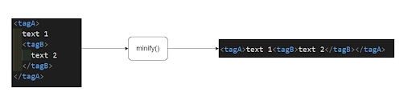
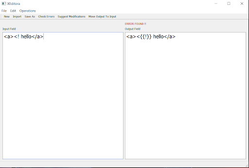
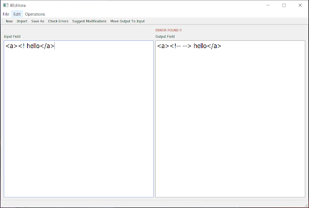
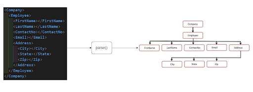
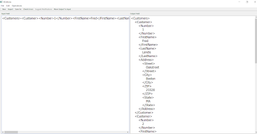
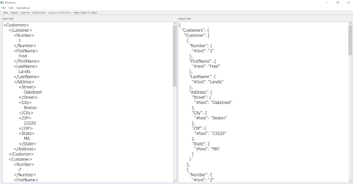
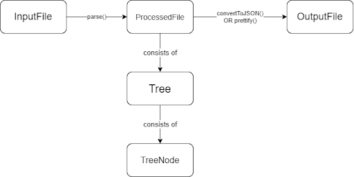

# XEditora
XEditora is an XML editor that read, modify and do multiple processes on XML files such as minifying, prettifying and conversion to JSON. It also checks for any errors in the XML file and in some cases, manages to solve the errors. Besides, it can also compress and decompress XML files to save space

Try it 👉 [Download Executables](https://drive.google.com/file/d/1oF_R_a_UZ5dh60h5I27G136qTJCrj41C/view?usp=sharing)

## Table of Contents
* [What can XEditora do?](#what-can-xeditora-do)
* [Data Structures](#data-structures)
* [Useful Links](#useful-links)

## What can XEditora do?
### Minifying
In the minifying function, we pass on the whole string removing all unnecessary spaces, tabs and newlines used for beautifying and readability so that the size of the file decrease

### Checking
We check the input XML from the file and compare it against the standard rules of XML syntax. We mark the errors we find one by one

### Correction
This feature tries to make the XML code free from syntax errors. It tries to fix syntax errors especially those related to comments and closing tags. For example, it matches the mismatched opening and closing tags, close open comments, etc.

### Parsing
This function aims to convert the string representing the XML file to a tree structure to be easily processed. Other functions depend on the output of this function like prettify and convert to JSON function where they depend on the tree structure output by this function

### Prettifying
This function takes an XML string and outputs a prettified version of that string. It uses the parse function first to convert that string into a tree. It then works on that tree to reprint the XML string in a prettified way.

### Conversion to JSON
This function also depends on the parsing function and works on the output tree to print the corresponding JSON to the input XML file.

### Compression
This function takes the text needed to be compressed and the file path to save the output, its output is a compressed file and another frequency table file used in decoding, the function checks that the text is not empty then it creates Huffman tree which encodes the characters then encodes the whole text and saves it to a new file with frequency table file.

### UI
The GUI is implemented in C++ Qt Framework. A simple UI is designed for easy access to the main features of the editor, where there is a menu bar which contains 3 main menu buttons (File, Edit and Operations).
* File menu: contains New, Import and Save As buttons.
* Edit menu: contains Move Input to Output button.
* Operations menu: contains Check Errors, Suggest Modifications, Prettify, Convert To JSON, Minify, Compress and Decompress buttons.

In addition, there is a toolbar for frequently used features which are: 
* New: used to clear both input and output fields.
* Import: used to import file content to the program.
* Save As: used to save the Output Field content to a new file.
* Check Errors: used to check for XML errors on the content of Input Field.
* Suggest Modifications: used to suggest modifications on some errors which may occur.
* Move Output To Input: used for quick cutting the content of the Output Field to the Input field to do other operations on it as minification, prettifying and XML to JSON conversion.

Also, There are 2 separate fields (Input Field and Output Field) to show the data after each operation.

## Data Structures
Due to the nature of XML files, the most important data structure used is the Tree data structure as it is the most similar data structure to the structure of XML. Using Tree data structure with the XML requires making a new data structure called Tree Node which represents the building blocks of the Tree data structure. Other data structures used are to represent the whole file at its different stages like the file being an input file or processed file or output file.

### Tree Node
This is the building block of the tree data structure. It represents a single tag or a comment or a text in the XML file. It contains (value) property that holds the name of the tag or the content of the comment or text. It also contains vectors to hold its children Tree Nodes, attributes of a tag. It also contains boolean properties to indicate whether it is a comment or text or a tag.

### Tree
This is the main data structure used to parse the XML file. It contains a single property which is a single tree node that holds the rest of its children tree nodes.

### Input File
This is a data structure which represents the file which the user chooses at the beginning. It holds the file content in a property and has another property which holds the status of checking the file contents against the XML standard syntax rules.

### Processed File
Represents an input file after processing using parse function. It consists of the XML tree and a group of XML declarations and comments.

### Output File
Represents the file in the state before viewing to the user. Usually the functions which produce the final output viewed to the user deal with that data structure and their output is stored in it

### Huffman Node
It’s used in compression operation, as we use Huffman lossless compression technique. It stores the value and its frequency in a text and has 2 pointers for the left and the right nodes.

### Huffman Tree
We use a minimum heap to build a binary tree, in which at first all the nodes which hold the characters are leaf nodes then we pop from the priority queue to build internal nodes until we have one remaining node in the priority queue.

## Useful Links
[XEditora Quick Tutorial (Arabic)](https://www.youtube.com/watch?v=GlOK0SHxQeA)

[XEditor Full Docs](https://docs.google.com/document/d/1OSrt5GGpNeyrs4Jh4LNT8QSNUD3s2IeYN83iff4HY94/edit?usp=sharing)

[XEditora executable files](https://drive.google.com/file/d/1oF_R_a_UZ5dh60h5I27G136qTJCrj41C/view?usp=sharing)
